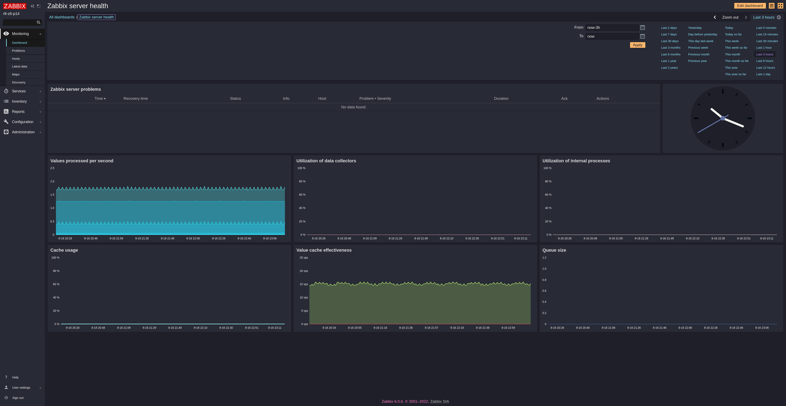

# zabbix 6.0 Naon Theme
Zabbix 6.0 Custom Dark Theme
> A dark theme for [Zabbix 6.0](https://www.zabbix.com/download?zabbix=6.0).

## Install
Copy this repository into Zabbix Server

Execute install.sh

Tested with RockyLinux and postgresql-14

## Notes
Changing severity background color done by adding entry at graph_theme table in zabbix database

Ref: https://www.zabbix.com/documentation/6.0/en/manual/web_interface/theming